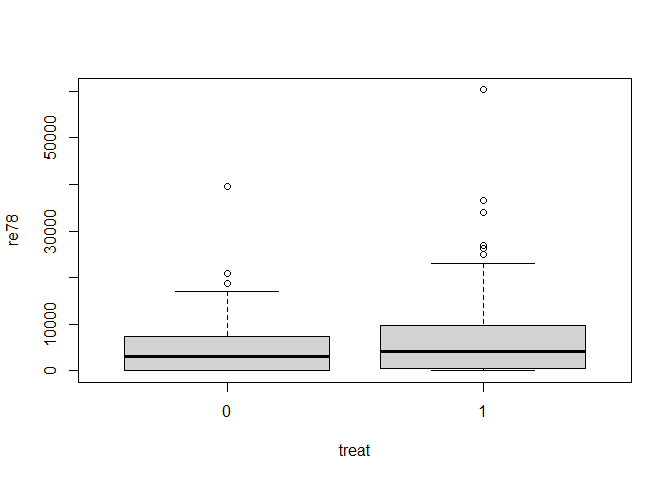
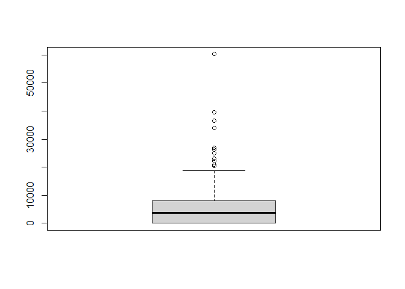
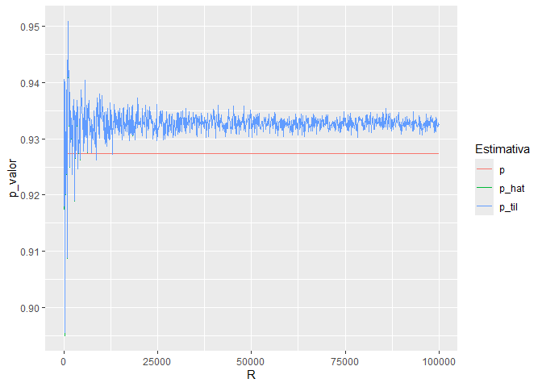
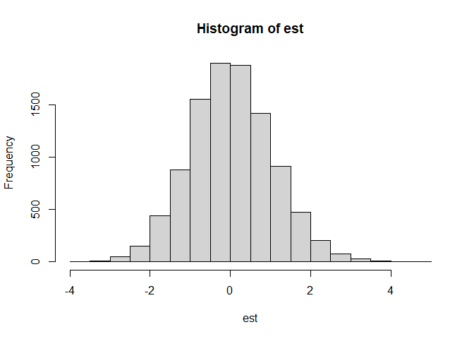
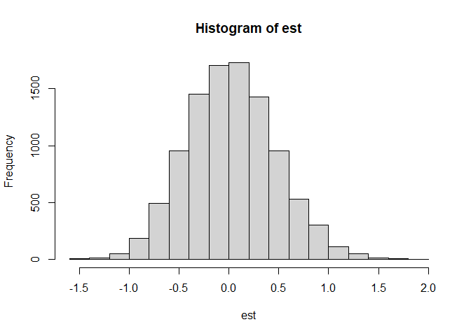
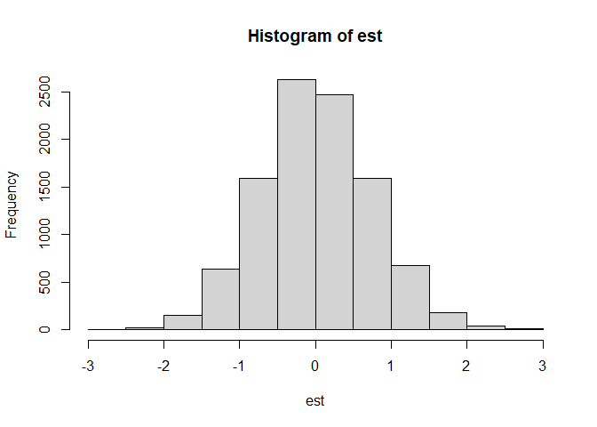
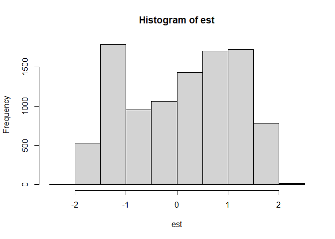

MI628 - Lista 2
================

# Pacotes e Funções

``` r
# PACOTES
library(Matching)
```

    ## Carregando pacotes exigidos: MASS

    ## ## 
    ## ##  Matching (Version 4.10-14, Build Date: 2023-09-13)
    ## ##  See https://www.jsekhon.com for additional documentation.
    ## ##  Please cite software as:
    ## ##   Jasjeet S. Sekhon. 2011. ``Multivariate and Propensity Score Matching
    ## ##   Software with Automated Balance Optimization: The Matching package for R.''
    ## ##   Journal of Statistical Software, 42(7): 1-52. 
    ## ##

``` r
library(tidyverse)
```

    ## ── Attaching core tidyverse packages ──────────────────────── tidyverse 2.0.0 ──
    ## ✔ dplyr     1.1.4     ✔ readr     2.1.5
    ## ✔ forcats   1.0.0     ✔ stringr   1.5.1
    ## ✔ ggplot2   3.5.0     ✔ tibble    3.2.1
    ## ✔ lubridate 1.9.3     ✔ tidyr     1.3.1
    ## ✔ purrr     1.0.2

    ## ── Conflicts ────────────────────────────────────────── tidyverse_conflicts() ──
    ## ✖ dplyr::filter() masks stats::filter()
    ## ✖ dplyr::lag()    masks stats::lag()
    ## ✖ dplyr::select() masks MASS::select()
    ## ℹ Use the conflicted package (<http://conflicted.r-lib.org/>) to force all conflicts to become errors

``` r
library(data.table)
```

    ## 
    ## Attaching package: 'data.table'
    ## 
    ## The following objects are masked from 'package:lubridate':
    ## 
    ##     hour, isoweek, mday, minute, month, quarter, second, wday, week,
    ##     yday, year
    ## 
    ## The following objects are masked from 'package:dplyr':
    ## 
    ##     between, first, last
    ## 
    ## The following object is masked from 'package:purrr':
    ## 
    ##     transpose

# Questão 3

## Implementação FRT da aula

``` r
# Conjunto de dados
data(lalonde)
z <- lalonde$treat # Tratamento
y <- lalonde$re78 # Resposta

n <- nrow(lalonde)
n1 <- sum(z)
n0 <- n - n1
tau <- mean(y[z == 1]) - mean(y[z == 0])
s2 = var(y)

# FRT TCL
est_teste_frt <- tau/sqrt(n*s2/(n1*n0))
pvalor_frt_clt <- 2 - 2*pnorm(est_teste_frt) # Bilateral

# FRT Monte Carlo
mc <- 10^5
est_teste_frt_mc <- rep(0, mc)
for (i in 1:mc) {
  zpermut <- sample(z)
  tau_permut <- mean(y[zpermut == 1]) - mean(y[zpermut == 0])
  est_teste_frt_mc[i] <- tau_permut/sqrt(n*s2/(n1*n0))
}
pvalor_frt_mc <- mean(abs(est_teste_frt_mc) > abs(est_teste_frt))

# FRT clássico teste t para dif medias 
est_test_frt_classico_t <- t.test(y[z == 1], 
                                  y[z == 0], var.equal = TRUE)$statistic
pvalor_frt_classico_t <- t.test(y[z == 1], 
                                y[z == 0], var.equal = TRUE)$p.value

# FRT MC via clássico teste t para dif medias 
est_test_frt_classico_t_mc <- rep(0, mc)

for (i in 1:mc) {
  z_permut <- sample(z)
  est_test_frt_classico_t_mc[i] <- t.test(y[z_permut == 1], 
                                          y[z_permut == 0], 
                                          var.equal = TRUE)$statistic
}

pvalor_frt_classico_t_mc <- mean(
  abs(est_test_frt_classico_t_mc) > abs(est_test_frt_classico_t
                                        ))
```

## Implementação FRT Estatística *t*-studentizada

``` r
FRT.t.studentizada <- function(DT, Y, Z, mc = 10^5) {
  
  y <- DT[[Y]]
  z <- DT[[Z]]
  
  n <- nrow(lalonde)
  n1 <- sum(z)
  n0 <- n - n1
  tau <- mean(y[z == 1]) - mean(y[z == 0])
  
  s2_1 <- var(y[z == 1])
  s2_0 <- var(y[z == 0])
  
  est_teste_frt <- tau/(sqrt(s2_1/n1 + s2_0/n0))

  est_teste_frt_mc <- rep(0, mc)
  for (i in 1:mc) {
    zpermut <- sample(z)
    tau_permut <- mean(y[zpermut == 1]) - mean(y[zpermut == 0])
    s2_1_permut <- var(y[zpermut == 1])
    s2_0_permut <- var(y[zpermut == 0])
    est_teste_frt_mc[i] <- tau_permut/(sqrt(s2_1_permut/n1 + s2_0_permut/n0))
  }
  
  pvalor_frt_mc <- mean(abs(est_teste_frt_mc) > abs(est_teste_frt))
  
  return(pvalor_frt_mc)
  
}

pvalor_frt_t_studentizada <- FRT.t.studentizada(lalonde, "re78", "treat")
```

## Implementação FRT Estatística de Wilcox

``` r
FRT.wilcox <- function(DT, Y, Z, mc = 10^5) {
  
  y <- DT[[Y]]
  z <- DT[[Z]]
  
  n <- length(y)
  n1 <- sum(z)
  n0 <- n - n1
  
  posto_y <- rank(abs(y), ties.method = c("average"))
  
  W <- sum(z * posto_y)
  
  NTIES <- table(posto_y)
  
  E_W <- n1 * (n + 1)/2
  # Estimativa da variância com correção para empates
  S_W <- sqrt(n1 * n0 * 1/12 * ((n + 1) - sum(NTIES^3 - NTIES)/((n) * (n - 1))))
  
  est_teste_frt <- (W - E_W)/S_W
  
  est_teste_frt_mc <- rep(0, mc)
  for (i in 1:mc) {
    zpermut <- sample(z)
    W_permut <- sum(zpermut * posto_y)
    
    est_teste_frt_mc[i] <- (W_permut - E_W)/S_W
    
  }
  
  pvalor_frt_mc <- mean(abs(est_teste_frt_mc) > abs(est_teste_frt))
  
  return(pvalor_frt_mc)
  
}

pvalor_frt_wilcox <- FRT.wilcox(lalonde, "re78", "treat")
```

## Resultados

``` r
c("FRT CLT" = pvalor_frt_clt,
  "FRT MC" = pvalor_frt_mc,
  "FRT Estatística t" = pvalor_frt_classico_t,
  "FRT Estatística t MC" = pvalor_frt_classico_t_mc,
  "FRT Estatística t studentizada" = pvalor_frt_t_studentizada,
  "FRT Estatística Wilcox" = pvalor_frt_wilcox)
```

    ##                        FRT CLT                         FRT MC 
    ##                    0.004906490                    0.004240000 
    ##              FRT Estatística t           FRT Estatística t MC 
    ##                    0.004787524                    0.004410000 
    ## FRT Estatística t studentizada         FRT Estatística Wilcox 
    ##                    0.007280000                    0.010780000

O *p-valor* do FRT utilizando a estatística *t*-studentizada, apesar de
estar próximo dos demais, é mais conservador quanto a
heterocedasticidade entre o grupo de tratamento e controle.

No *boxplot* de *re78 ~ treat*, é possível notar a diferença que
distribuição do grupo tratamento é mais assimétrica à direita do que o
grupo controle.

``` r
boxplot(re78 ~ treat, data = lalonde)
```

<figure>

<figcaption aria-hidden="true">Boxplot de re78 ~ treat</figcaption>
</figure>

Enquanto o *p-valor* do FRT utilizando a estatística Wilcox é mais
conservador quanto à presença de *outliers*, os quais estão presentes na
distribuição *re78*, destacados no *boxplot*.

``` r
boxplot(lalonde$re78)
```

<figure>

<figcaption aria-hidden="true">Boxplot de re78 ~ treat</figcaption>
</figure>

# Questão 4

## *p-valor* exato

``` r
# Tempo de início
time_init <- Sys.time()

n <- 20 # Tamanho da amostra
n1 <- n/2 # Qtd. tratamento
n0 <- n - n1 # Qtd. controle
y0 <- sort(rnorm(n), decreasing = TRUE) # Valores de y controle
tau <- 0 # Efeito causal
y1 <- y0 + tau # Valores de y tratamento
z <- sample(c(0, 1), size = n, replace = T, prob = c(n0, n1)) # Simulando tratamentos
y <- ifelse(z == 1, y1, y0) # Respostas

# Qtd. de permutações n1 em n
M <- factorial(n)/(factorial(n1)*factorial(n-n1))

# Todas as combinações de n1 em n
Z <- data.table(t(gtools::combinations(n, n1)))

# Identificador do registro
ID <- data.table(id = seq_len(n))

# FRT
tau_est <- mean(y[z == 1]) - mean(y[z == 0])
s2_est <- var(y)
est_teste_frt <- tau_est/sqrt(n*s2_est/(n1*n0))

# Teste FRT (diferença de médias)
est_T <- apply(Z, 2, function(z) {
  
  # Selecionando vetor z_m tratamento
  z_m <- Z[, .(z)]
  
  # Identificação dos registros para tratamento
  z_m[, id := z]
  
  # Incluindo identificação tratamento/controle
  z_m <- z_m[ID, on = .(id)]
  z_m[, z := ifelse(is.na(z), 0, 1)]
  
  # Vetor z_m completo
  z_m <- z_m[, z]
  
  # Efeito causal médio
  tau <- mean(y[z_m == 1]) - mean(y[z_m == 0])

  # FRT MC
  est_teste_frt_mc <- tau/sqrt(n*s2_est/(n1*n0))
  teste_frt <- abs(est_teste_frt_mc) > abs(est_teste_frt)
  
  return(teste_frt)
  
})

# p-valor FRT
p_FRT <- mean(est_T)

# Tempo final
time_final <- Sys.time()

# Tempo de processamento
time_final - time_init
```

    ## Time difference of 28.37935 mins

## *p-valores* aproximados

``` r
# Valores de R para o MC
R_valores <- seq(100, 100000, 100)

# Valores de para cada R
dt_p_FRT <- data.table()

# FRT MC 
for (R in R_valores) {
  
  # Estatisticas MC
  est_teste_frt_mc <- rep(0, R)
  
  for (i in 1:R) {
    zpermut <- sample(z)
    tau_permut <- mean(y[zpermut == 1]) - mean(y[zpermut == 0])
    est_teste_frt_mc[i] <- tau_permut/sqrt(n*s2_est/(n1*n0))
    
  }
  
  # Indicadora de T_MC > T_obs
  T_est <- abs(est_teste_frt_mc) > abs(est_teste_frt)
  
  # p_valor_hat
  p_hat_FRT <- mean(T_est)
  
  # p_valor_til
  p_til_FRT <- (1 + sum(T_est))/(1+R)
  
  # Salvando valores da iteração
  dt_p_FRT_R <- data.table(R = R,
                           p = p_FRT,
                           p_hat = p_hat_FRT,
                           p_til = p_til_FRT)
  dt_p_FRT <- rbind(dt_p_FRT, dt_p_FRT_R)
  
}

# Gráfico da convergência em R
dt_p_FRT %>% 
  pivot_longer(cols = c("p", "p_hat", "p_til"), names_to = "Estimativa", 
               values_to = "p_valor") %>% 
  ggplot() +
  geom_line(aes(x = R, y = p_valor, color = Estimativa))
```

<!-- -->

# Questão 6b

``` r
# Tabela Científica (CRE)
n <- 100
n1 <- 60
n0 <- 40
y0 <- sort(rexp(n), decreasing = TRUE)
tau <- 1
y1 <- y0 + tau

# Vetor de tratamentos e efeito causal médio
z <- sample(c(rep(1, n1), rep(0, n0)))
tau_hat <- mean(y1[z == 1]) - mean(y0[z == 0])
var_hat_tau <- var(y1) / n1 + var(y0) / n0 - var(y1 - y0) / n

# Estimador conservador til
V_til <- 1/n * (sqrt(n0/n1) * sd(y1[z == 1]) + sqrt(n1/n0) * sd(y0[z == 0]))^2

# Gerenado 10^4 CRE
tau_hat_p <- c()
V_til_p <- c()
lim_sup <- c()
lim_inf <- c()
est <- c()
for (i in 1:10^4) {
  z_permut <- sample(z)
  tau_hat_p[i] <- mean(y1[z_permut == 1]) - mean(y0[z_permut == 0])
  V_til_p[i] <- 1/n * (sqrt(n0/n1) * sd(y1[z_permut == 1]) + sqrt(n1/n0) * sd(y0[z_permut == 0]))^2
  lim_sup[i] <- tau_hat_p[i] + 1.96*sqrt(V_til_p[i])
  lim_inf[i] <- tau_hat_p[i] - 1.96*sqrt(V_til_p[i])
  est[i] <- (tau_hat_p[i] - tau) / sqrt(V_til_p[i])
}

# Comparando valores real, estimado e MC
c("var_hat_tau" = var_hat_tau,
  "V_til" = V_til,
  "V_til_MC" = mean(V_til_p))
```

    ## var_hat_tau       V_til    V_til_MC 
    ##  0.04924418  0.05012765  0.04878292

``` r
# Cobertura do valor real nos intervalos
cobertura <- c()
for (i in 1:10^4) {
  cobertura[i] <- ifelse(lim_inf[i] < tau && tau < lim_sup[i], 1, 0)
}
mean(cobertura)
```

    ## [1] 0.9418

``` r
hist(est)
```

<!-- -->

# Caso 1

``` r
y0 <- sort(y0, decreasing = FALSE)
var_hat_tau <- var(y1) / n1 + var(y0) / n0 - var(y1 - y0) / n
var_hat_tau
```

    ## [1] 0.009483101

``` r
tau_hat_p <- c()
V_til_p <- c()
lim_sup <- c()
lim_inf <- c()
cobertura <- c()
for (i in 1:10^4) {
  z_permut <- sample(z)
  tau_hat_p[i] <- mean(y1[z_permut == 1]) - mean(y0[z_permut == 0])
  V_til_p[i] <- 1/n * (sqrt(n0/n1) * sd(y1[z_permut == 1]) + sqrt(n1/n0) * sd(y0[z_permut == 0]))^2
  lim_sup[i] <- tau_hat_p[i] + 1.96*sqrt(V_til_p[i])
  lim_inf[i] <- tau_hat_p[i] - 1.96*sqrt(V_til_p[i])
  cobertura[i] <- ifelse(lim_inf[i] < tau && tau < lim_sup[i], 1, 0)
  est[i] <- (tau_hat_p[i] - tau) / sqrt(V_til_p[i])
}
c(mean(V_til_p), mean(cobertura))
```

    ## [1] 0.04894436 1.00000000

``` r
hist(est)
```

<!-- -->

# Caso 2

``` r
y0 <- sample(y0)
var_hat_tau <- var(y1) / n1 + var(y0) / n0 - var(y1 - y0) / n
var_hat_tau
```

    ## [1] 0.02548106

``` r
tau_hat_p <- c()
V_til_p <- c()
lim_sup <- c()
lim_inf <- c()
cobertura <- c()
for (i in 1:10^4) {
  z_permut <- sample(z)
  tau_hat_p[i] <- mean(y1[z_permut == 1]) - mean(y0[z_permut == 0])
  V_til_p[i] <- 1/n * (sqrt(n0/n1) * sd(y1[z_permut == 1]) + sqrt(n1/n0) * sd(y0[z_permut == 0]))^2
  lim_sup[i] <- tau_hat_p[i] + 1.96*sqrt(V_til_p[i])
  lim_inf[i] <- tau_hat_p[i] - 1.96*sqrt(V_til_p[i])
  cobertura[i] <- ifelse(lim_inf[i] < tau && tau < lim_sup[i], 1, 0)
  est[i] <- (tau_hat_p[i] - tau) / sqrt(V_til_p[i])
}
c(mean(V_til_p), mean(cobertura))
```

    ## [1] 0.04904799 0.99180000

``` r
hist(est)
```

<!-- -->

# Caso 3

``` r
set.seed(123)
eps <- rbinom(n, 1, 0.4)
y0 <- (1 - eps) * rexp(n) + eps*rcauchy(n)
tau <- 1
y1 <- y0 + tau

tau_hat_p <- c()
V_til_p <- c()
lim_sup <- c()
lim_inf <- c()
cobertura <- c()
est <- c()
for (i in 1:10^4) {
  z_permut <- sample(z)
  tau_hat_p[i] <- mean(y1[z_permut == 1]) - mean(y0[z_permut == 0])
  V_til_p[i] <- 1/n * (sqrt(n0/n1) * sd(y1[z_permut == 1]) + sqrt(n1/n0) * sd(y0[z_permut == 0]))^2
  lim_sup[i] <- tau_hat_p[i] + 1.96*sqrt(V_til_p[i])
  lim_inf[i] <- tau_hat_p[i] - 1.96*sqrt(V_til_p[i])
  cobertura[i] <- ifelse(lim_inf[i] < tau && tau < lim_sup[i], 1, 0)
  est[i] <- (tau_hat_p[i] - tau) / sqrt(V_til_p[i])
}

c(mean(V_til_p), mean(cobertura))
```

    ## [1] 0.7987814 0.9960000

``` r
hist(est)
```

<!-- -->
